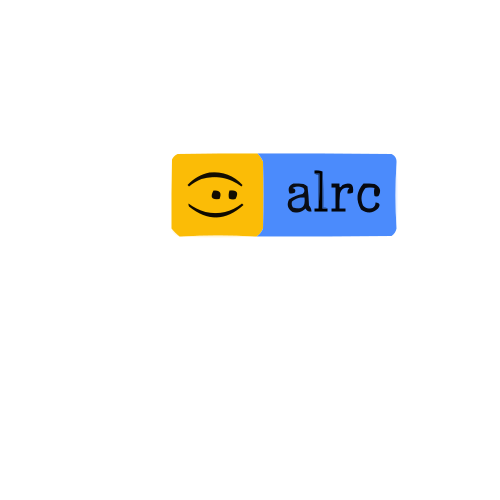

# +2 New plugins added since version 4.3.06, try it now!

<p align="center">
  
</p>
<div align="center">
<a href="https://github.com/luisadha/alrc-termux" title="Go to GitHub repo"></a>
<a href="https://github.com/luisadha/alrc-termux"></a>
<a href="https://github.com/luisadha/alrc-termux"></a>
<!-- <a href="https://github.com/luisadha/alrc-termux/actions?query=workflow:%22GH+Pages+Deploy%22"></a>
-->
<a href="https://github.com/luisadha/alrc-termux/releases/"></a>
<a href="#license"></a>
<a href="https://github.com/luisadha/alrc-termux/issues"></a>
</div>

<h2>Demo</h2>
<a href="https://asciinema.org/a/WBz9QOP5xNeKLFcIOB9wZYeBP" target="_blank"></a>

<!-- [](https://www.youtube.com/shorts/9X6naGKNOys) -->
DESCRIPTION
-----------
Alrc-termux is a framework designed to enrich the Termux user experience by providing bash shell configuration and useful plugins."

INSTALLATION
------------

### REQUIREMENTS
- Install the application with the [Termux App](https://f-droid.org/packages/com.termux/),
[Termux API](https://f-droid.org/packages/com.termux.api/), the [Termux Widget](https://f-droid.org/packages/com.termux.widget/) and the Optional Termux Float
- Enough basic tools like git, curl, grep, sed, gawk, bc, cut and more.
- Ran \`termux-setup-storage' first and Uncomment or write `allow-external-apps = true` in ~/.termux/termux.properties.
- This requires the environment variable export PATH="$PATH:/system/bin " set to be used for the \`input' and \`am' commands.


A. Termux
---------
- *Automatic*

```sh
. <(curl -L https://raw.githubusercontent.com/luisadha/alrc-termux/main/install.sh)
```

- *Manual*
	
clone this repository

```sh
export PATH="$PATH:$HOME/.local/bin"; git clone https://github.com/luisadha/alrc-termux.git ~/.local/share/alrc-termux
```

<!--if you use github (**recommended**)

```sh
export PATH="$PATH:$HOME/.local/bin"; git clone https://github.com/luisadha/alrc-termux.git ~/.local/share/alrc-termux
``` -->


and linking alrc to your ~/.local/bin path

```sh
ln -s ~/.local/share/alrc-termux/alrc ~/.local/bin/alrc
```

and then follow step [usage](#usage) or try the following alternatives [one line command](#test)

- *Uninstall*

	```
	alrc uninstall
	```

- *Updates*

	```
	alrc updates
	```

B. Other Platform Termux based
------------------------------

  If you install alrc-termux in another place like fork termux. You can replace/remove the shebang! so you can continue the installation process. But it is highly recommended to install it in Termux environment

USAGE
-----

### usage:

Copy the following code snippet, paste it into the terminal. This will add the configuration directly to your .bash_profile

```text
echo ' export PATH="$PATH:$HOME/.local/bin:/system/bin" ' >> ~/.bash_profile

echo ' source <(~/.local/bin/alrc env)> /dev/null 2>&1; ' >> ~/.bash_profile

echo ' al;' >> ~/.bash_profile
```

```text

chsh -s bash && login      change to bash shell and exit

whatisal                   print this help message and return
```

### Templates
> Use the templates [folder](https://github.com/luisadha/alrc-termux/tree/main/templates) for config recommendations or [online config example](https://luisadha.my.id)

### Test & Testing
#### test
> GUI: Test with the termux widget. If you don't want to mess up your .bash_profile, put the file ~/local/share/alrc-termux/test/.shortcuts/alrc.test To ~/.shortcuts/alrc.test Then make the Termux widget run from there, if it doesn't show up do the refresh.

> CLI: shot on terminal with 

```
bash ~/.shortcuts/alrc.test 
```

#### testing

- [x] Termux
- [x] Ztmexluis
- [x] Acode Terminal (Plugin Acode)
- [ ] AndroidIDE (Terminal) But some gui features and features that require fire extinguishers won't work.
- [ ] Nix-on-droid But some gui features and features that require fire extinguishers won't work.
- [ ] Proot-distro (Experimental)
- [ ] Replit (Just for testing purposes)
- [ ] Wayland (Not working Alif said)

BUGS
----
- The al option, namely al_ab, cannot be exported to environment variables. I don't know why that can.
- On my device The imjpgrand automation feature won't consistently select the image viewer even if I press "Select always" in the end the solution was that one of the apps had to be uninstalled. I kept the zarchiver viewer and deleted the other one.
- Be careful installing other dotfiles, it can cause unwanted bugs/errors due to misconfiguration. first uninstall alrc-termux if you want to try using other dotfiles. termux-desktop causes imjpgrand to not work and other weird bugs.
- MI Music and DMP Music player are tested, brandomusicv only tested on mi music player version 6.4.20i other than that version does not work (solution uninstall update or change to another supported music player).


ROADMAP
-------

DEV: I no longer create scripts for the .shortcuts folder "It was tiring" but requests will still be accepted just not our priority anymore.

DEV: I welcome new plugin support ideas

CONTRIBUTION
------------
Feedback, contributors, pull requests are all very welcome.

### Thanks & Reference

- God 
 
- Contributor

- Termux Apps https://github.com/termux/termux-app

- Termuxlauncher  Plugin Dependencies  https://github.com/amsitlab/termuxlauncher/releases

- Mkshrc (Inspirations) https://forum.xda-developers.com/t/shell-mksh-scripting-mksh-r50e-static-full-mkshrc_mods.2770804/

- Many internet source

AUTHOR AND CONTRIBUTOR
----------------------
__Luis Adha__

__Fmways__

LICENSE
-------
Copyright © 2023 Adharudin (Luis Adha). License GPLv3+: GNU GPL version 3 or later http://gnu.org/licenses/gpl.html. This is free software: you are free to change and redistribute it. There is NO WARRANTY, to the extent permitted by law.

This project is licensed under the [GPL-3.0 License](https://www.gnu.org/licenses/gpl-3.0.en.html). Please refer to the license link for more information.
